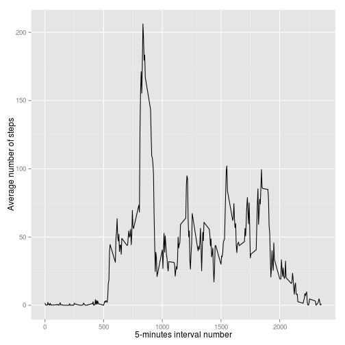

# Reproducible Research: Peer Assessment 1


## Loading and preprocessing the data
Loading the data file with a header. Ensure that dates are recognized as dates.
The csv file should be in the same folder than this Rmd file. 
You need to set this folder as the working directory. 


```r
data = read.csv("activity.csv", h = T, na.strings = "NA")
data$date <- as.Date(data$date, "%Y-%m-%d")
```


## What is mean total number of steps taken per day?
Loading the 'plyr' package to compute the sum of steps per day.
Then, plot these sums as an histogram.


```r
library(plyr)
# Keep only complete case
data.complete = data[complete.cases(data), ]
sum_steps = ddply(data.complete, .(date), summarise, sumSteps = sum(steps))
hist(sum_steps$sumSteps, main = "Histogram of total steps per day", xlab = "Total of steps per day")
```

 

```r
# Change the limit to display values as scientific format
options(scipen = 20)
```


The mean total number of steps taken each day is **10766.1887** and the median is **10765**.


## What is the average daily activity pattern?
Compute the number of steps per interval of 5-minutes across all days.
Plot these averages using ggplot. 
Finally, find which interval corresponds to the maximum number of steps.


```r
steps.interval = ddply(data.complete, .(interval), summarise, mSteps = mean(steps))
require(ggplot2)
```

```
## Loading required package: ggplot2
```

```r
ggplot(data = steps.interval, aes(interval, mSteps)) + geom_line() + xlab("5-minutes interval number") + 
    ylab("Average number of steps")
```

 

```r
maxinter = steps.interval[steps.interval$mSteps == max(steps.interval$mSteps), 
    1]
```


The 5-minutes interval, on average across all the days in the dataset, containing the maximum number of steps is the **835th** interval.


## Imputing missing values

There are **2304** missing values in the data frame.

Replace missing values by the mean of the current 5-minutes interval across all days.
Plot the new data as an histogram.


```r
# Function to replace NA value by the mean of equivalent interval
replace.na = function(x) {
    if (is.na(x[1])) {
        value = steps.interval[which(steps.interval$interval == as.numeric(x[3])), 
            2]
    } else {
        value = x[1]
    }
    return(value)
}
# Apply the function to each row of the data frame
nsteps = as.numeric(apply(data, 1, replace.na))
# Combined the original data frame with the filled values
dtfilled = cbind(data, nsteps)
sum_dtfilled = ddply(dtfilled, .(date), summarise, sumSteps = sum(nsteps))
hist(sum_dtfilled$sumSteps, main = "Histogram of total steps per day", xlab = "Total of steps per day")
```

 


The mean total number of steps taken each day with NA replaced is **10766.1887** and the median is **10766.1887**.
These values are very close to those compute by removing the missing-values. 
The means are equals and the the median with filled values is slighty below the one with  missing-values removed. 


## Are there differences in activity patterns between weekdays and weekends?


```r
# Subset only weekend days and add 'weekend' as label
weekend = subset(dtfilled, weekdays(date) == "Saturday" | weekdays(date) == 
    "Sunday")
weekend$weekend = "weekend"
# Subset only week days and add 'week' as label
weekday = subset(dtfilled, weekdays(date) != "Saturday" & weekdays(date) != 
    "Sunday")
weekday$weekend = "weekday"
# Recombined week and weekend data frame
data.week = rbind(weekend, weekday)
data.week.me = ddply(data.week, .(weekend, interval), summarise, mSteps = mean(nsteps))
# Create the time series plot by weekday kind
ggplot(data = data.week.me, aes(interval, mSteps)) + geom_line() + facet_grid(weekend ~ 
    .) + xlab("5-minutes interval number") + ylab("Average number of steps")
```

 


